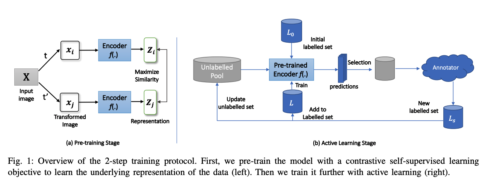
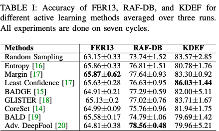

# FER SSL
 
Official Of our ACII 2023 paper:

> [**Active Learning with Contrastive Pre-training for Facial Expression Recognition**](https://arxiv.org/abs/2307.02744)      
> Shuvendu Roy, Ali Etemad       
> *In Proceedings of the IEEE International Conference on Affective Computing and Intelligent Interaction (ACII), 2023*


<p align="center">
  
</p>

### Dataset
We used the following dataset in this work. Plese follow the instructions in the respective website to download the dataset.
1. [KDEF](https://www.kdef.se/)
2. [FER-13](https://www.kaggle.com/datasets/msambare/fer2013)
3. [RAF-DB](http://www.whdeng.cn/RAF/model1.html)

Store the datasets in the ```./data``` directory.
The processed dataset structure should look like this:
```
dataset_name
├── train
│   ├── class_001
|   |      ├── 1.jpg
|   |      ├── 2.jpg
|   |      └── ...
│   ├── class_002
|   |      ├── 1.jpg
|   |      ├── 2.jpg
|   |      └── ...
│   └── ...
└── val
    ├── class_001
    |      ├── 1.jpg
    |      ├── 2.jpg
    |      └── ...
    ├── class_002
    |      ├── 1.jpg
    |      ├── 2.jpg
    |      └── ...
    └── ...
```

### Installation 
Make sure you install the requirements before trying to run the models.

```
pip3 install -r requirements/requirements.txt
```

### Training 
The training process of the proposed solution involves two steps. First pre-train the encoder with the following script.

```
python pre_train.py --dataset FER13 \
  --batch_size 1024 \
  --learning_rate 0.5 \
  --temp 0.1 \
  --cosine
```

Then, train the model with the following script.
```
python train.py --config_path config/FER13.yaml
```
make sure to replace the path to the pre-trained model in the config file. 


### Results
<p align="center">
 
</p>


### Acknowledgements
We would like to thank the authors of the following repositories for releasing their code. We used their code as a starting point for our implementation for active learning methods. 
- https://github.com/decile-team/distil
### Citation
 
Please cite our paper if you this code repo in your work.
```
@inproceedings{roy2023active,
  title={Active Learning with Contrastive Pre-training for Facial Expression Recognition},
  author={Roy, Shuvendu and Etemad, Ali},
  booktitle={11th International Conference on Affective Computing and Intelligent Interaction (ACII)},
  pages={1--8},
  year={2023},
  organization={IEEE}
}
```

## Contact
Thanks for your attention!
If you have any suggestion or question, you can contact us:
- shuvendu.roy@queensu.ca

